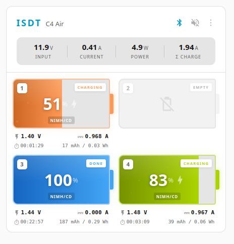

# ISDT Charger Card

[](https://github.com/hacs/integration)
[](https://github.com/mtheli/isdt_air_card/releases)
[](LICENSE)

Custom Lovelace card for [ISDT Air BLE](https://github.com/mtheli/isdt_air_ble) chargers in Home Assistant. Select your charger device and all entities are discovered automatically. Battery-style design that adapts to your HA theme (light & dark).



## Features

- **Device-based setup** — select your ISDT Air BLE device, no entity prefix needed
- **Auto-discovery** of all entities via translation key and sub-device mapping
- **Battery-shaped slots** with liquid fill level, wave animation & bubbles
- **HA theme-aware** — automatically adapts to any light or dark theme
- **Header** with input voltage, current, power, total charging current, beep toggle
- **Per-slot details**: voltage, current, live charge timer, battery type, mAh/Wh
- **Status animations**: green glow (charging), blue (done), red pulse (error)
- **Click any slot** to open the HA more-info dialog

## Installation

### HACS (recommended)

1. Open HACS → **Frontend** → ⋮ → **Custom repositories**
2. Add this repository URL as **Dashboard**
3. Search for "ISDT Charger Card" and install
4. Refresh your browser (Ctrl+F5)

### Manual

1. Copy `dist/isdt-charger-card.js` to `config/www/isdt-charger-card.js`
2. Add the resource in HA:
   - **Settings → Dashboards → ⋮ → Resources**
   - URL: `/local/isdt-charger-card.js`
   - Type: **JavaScript Module**
3. Refresh your browser

## Configuration

```yaml
type: custom:isdt-charger-card
device_id: <your-device-id>
```

The card uses HA's native device picker — just select your ISDT charger from the dropdown. All entities are discovered automatically.

### Options

| Option | Default | Description |
|--------|---------|-------------|
| `device_id` | *(required)* | ISDT Air BLE device ID |
| `title` | device name | Override the card title |
| `show_header` | `true` | Show header with input stats |

## Status Colors

| Status | Color | Effect |
|--------|-------|--------|
| Empty | Dimmed | Battery-off icon |
| Idle | Neutral | Subtle fill |
| Charging | Green | Glow + wave + bubbles |
| Done | Blue | Glow |
| Error | Red | Pulsing border |

## Related

- [ISDT Air BLE Integration](https://github.com/mtheli/isdt_air_ble) — the Home Assistant integration this card is built for

## License

MIT
