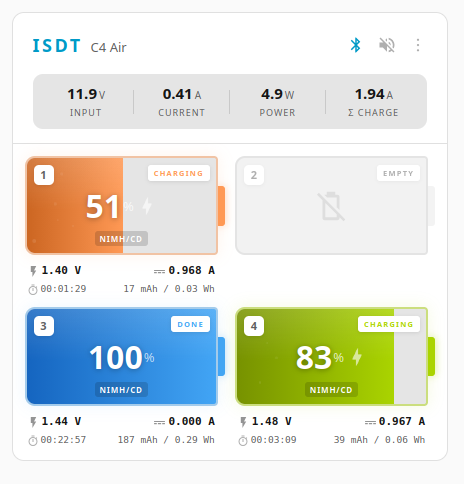
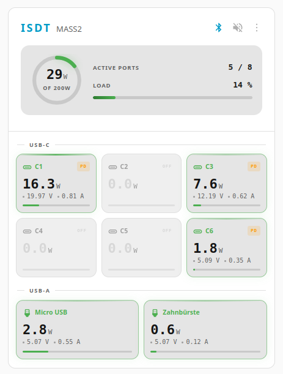

# ISDT Air Card

[](https://github.com/hacs/integration)
[](https://github.com/mtheli/isdt_air_card/releases)
[](LICENSE)

Custom Lovelace card for [ISDT Air BLE](https://github.com/mtheli/isdt_air_ble) chargers and adapters in Home Assistant. Select your device and all entities are discovered automatically. Adapts to your HA theme (light & dark).

Two layouts, picked automatically from the device model:

### Charger (C4 Air, NP2 Air, …)



### Adapter (MASS2)



## Features

### Charger layout
- **Battery-shaped slots** with liquid fill level, wave animation & bubbles
- **Header** with input voltage, current, power, total charging current, beep toggle
- **Per-slot details**: voltage, current, live charge timer, battery type, mAh/Wh
- **Status animations**: green glow (charging), blue (done), red pulse (error)

### Adapter layout (MASS2)
- **Power gauge ring** showing total W of device maximum, plus active-port count and load %
- **8-port grid** — 6× USB-C and 2× USB-A tiles, each with watts, V/A, protocol badge (PD/FAST) and load bar
- **Sound popover** in the header — click the speaker icon to pick Mute / Low / Med / High
- **Rename-aware**: port labels follow `name_by_user` when you rename a sub-device in the HA UI ("USB-A1" → "Toothbrush")
- **Pulse-charging safe**: the tile state follows the integration's phantom-load filter, so actively charging devices (e.g. a NiMH charger on USB-C) don't flip between active/off

### Both
- **Device-based setup** — select your ISDT device, no entity prefix needed
- **Auto-discovery** of all entities via device identifiers and translation keys
- **HA theme-aware** — automatically adapts to any light or dark theme
- **Click any tile** to open the HA more-info dialog

## Installation

### HACS (recommended)

1. Open HACS → **Frontend** → ⋮ → **Custom repositories**
2. Add this repository URL as **Dashboard**
3. Search for "ISDT Charger Card" and install
4. Refresh your browser (Ctrl+F5)

### Manual

1. Copy `dist/isdt-charger-card.js` to `config/www/isdt-charger-card.js`
2. Add the resource in HA:
   - **Settings → Dashboards → ⋮ → Resources**
   - URL: `/local/isdt-charger-card.js`
   - Type: **JavaScript Module**
3. Refresh your browser

## Configuration

```yaml
type: custom:isdt-charger-card
device_id: <your-device-id>
```

The card uses HA's native device picker — just select your ISDT charger from the dropdown. All entities are discovered automatically.

### Options

| Option | Default | Description |
|--------|---------|-------------|
| `device_id` | *(required)* | ISDT Air BLE device ID |
| `title` | device name | Override the card title |
| `show_header` | `true` | Show header with input stats |

## Status Colors

| Status | Color | Effect |
|--------|-------|--------|
| Empty | Dimmed | Battery-off icon |
| Idle | Neutral | Subtle fill |
| Charging | Green | Glow + wave + bubbles |
| Done | Blue | Glow |
| Error | Red | Pulsing border |

## Related

- [ISDT Air BLE Integration](https://github.com/mtheli/isdt_air_ble) — the Home Assistant integration this card is built for

## Disclaimer

This is an independent community project and is not affiliated with, endorsed by, or sponsored by ISDT. All product names, trademarks, and registered trademarks are property of their respective owners.

## License

MIT
